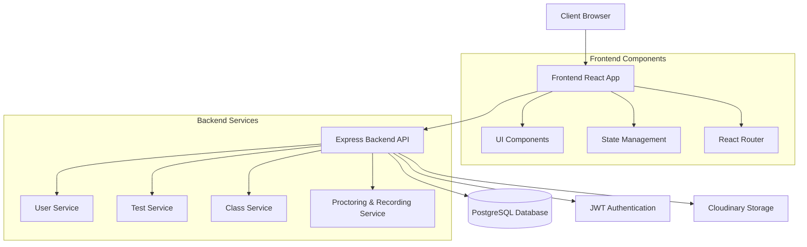
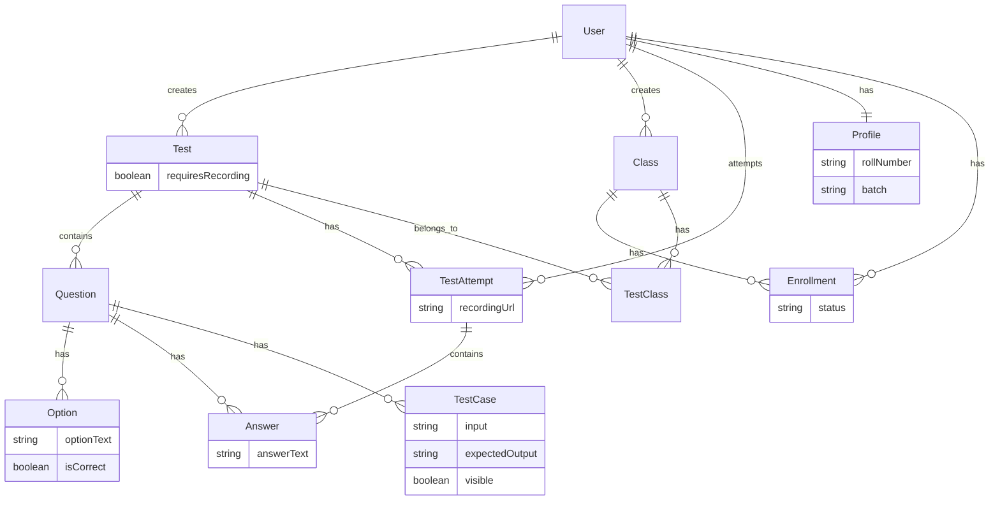
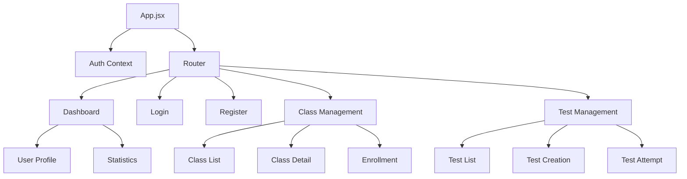

# Exam Matrix

A comprehensive full-stack web application for managing online examinations and tests. This platform enables teachers to create and manage tests while allowing students to take them in a structured environment.

## System Architecture



## Database Schema



##### "TestClass" is defined by its relationships above

## Component Structure



## Features

- User Authentication and Authorization
- Class Management
- Test Creation and Management
- Multiple Question Types Support (MCQ, Checkbox, Text, Coding)
- Test Attempt Tracking
- Score Management
- Class Enrollment System
- Configurable Recording Requirement per Test
- Device Check (Camera/Microphone) before Test Start
- Fullscreen Mode Enforcement
- Violation Tracking (tab switch, fullscreen exit, copy/paste, dev tools)
- Video/Audio Proctoring for Tests (if enabled)
- Admin View of Test Recordings (links to Cloudinary)
- Calendar Integration for Scheduled Tests
- Student and Admin Dashboards with Analytics

## Tech Stack

### Frontend

- React with Vite
- Material-UI (@mui/material)
- React Query for data fetching
- React Router for navigation
- Tailwind CSS for styling
- Recharts for data visualization

### Backend

- Node.js with Express
- PostgreSQL database with Prisma ORM
- JWT for authentication
- Bcrypt for password hashing
- `multer` for file uploads (recording)
- `streamifier` for streaming to Cloudinary
- Cloudinary for video storage

## Project Structure

```
├── src/                    # Frontend source code
│   ├── components/        # React components
│   ├── hooks/            # Custom React hooks
│   ├── api/              # API integration
│   ├── utils/            # Utility functions
│   ├── services/         # Business logic
│   ├── context/          # React context
│   └── assets/           # Static assets
├── server/               # Backend code
│   ├── routes/          # API routes
│   ├── controllers/     # Request handlers
│   ├── middleware/      # Express middleware (e.g., auth)
│   ├── utils/           # Utility functions (e.g., cloudinary.js)
│   └── index.js         # Server entry point
├── prisma/              # Database schema and migrations
└── public/              # Public assets
```

## Database Schema

The application includes several key models:

- `User` - Handles user accounts with roles (STUDENT/ADMIN)
- `Profile` - Additional user information
- `Test` - Exam/test management
- `Question` - Different types of questions
- `Class` - Class management
- `Enrollment` - Student enrollment in classes
- `TestAttempt` - Student attempts at tests
- `Answer` - Student answers to questions
- `CalendarEvent` - For scheduling tests and other events

## API Endpoints

The backend exposes several API routes:

- `/api/auth` - Authentication endpoints
- `/api/users` - User management
- `/api/tests` - Test management
- `/api/classes` - Class management
- `/api/tests/attempts/all` - Get all test attempts (admin only)
- `/api/tests/attempts/my` - Get user's own test attempts
- `/api/calendar` - Calendar event management

## Getting Started

### Prerequisites

- Node.js (v14 or higher)
- PostgreSQL
- npm or yarn

### Installation

1. Clone the repository:

```bash
git clone [repository-url]
cd exam-matrix
```

2. Install dependencies:

```bash
npm install
```

3. Set up environment variables:
   Create a `.env` file in the root directory by copying the `.env.sample` manually or just by removing the `.sample` from its name and then update the necessary values.

4. Set up the database:

```bash
npm run prisma:generate
npm run prisma:migrate
```

### Running the Application

1. Start the development server:

```
npm run dev
npm run dev:server
```
